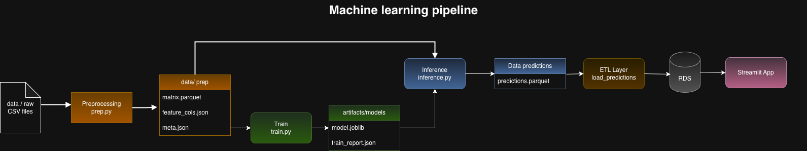

# 1C Company — Producto de Datos de Pronóstico de Ventas

> **POC de Machine Learning en producción** para el pronóstico mensual de demanda a nivel producto–tienda, desplegado como aplicación Streamlit en AWS con URL pública.

🔗 **URL de la app:** `http://<ALB-DNS>/` *(actualizar tras deploy)*  
📹 **Video demo:** *(enlace a subir)*

---

## 🎯 Objetivo

Transformar el modelo de ML entrenado en las tareas 01–07 en un **producto de datos operativo** que las áreas de planeación, finanzas, BI y operaciones puedan consumir sin depender de un data scientist.

El sistema pre-computa predicciones para el mes 34 (noviembre 2015), las almacena en PostgreSQL y las expone a través de una aplicación web con cinco vistas especializadas por perfil de negocio.

---

## 🏢 Contexto del Negocio

**1C Company** opera una cadena de retail con **22,170 productos** en **60 tiendas**. El COO necesitaba reducir el RMSE de predicción de ~11 a <5 unidades para optimizar inventarios y evitar quiebres de stock.

En este MVP demostramos:

- **Pronósticos mensuales** con intervalos de confianza (lower/upper bound)
- **Evaluación por grupo** — RMSE por categoría y por tienda vs baseline naive
- **Feedback de negocio** — captura de observaciones sobre productos problemáticos
- **Acceso sin fricción** — URL pública, filtros interactivos, export a CSV

---

## 🏗️ Arquitectura


**Servicios AWS utilizados:** S3 · ECR · ECS Fargate · ALB · RDS PostgreSQL · Secrets Manager · Glue Data Catalog · CloudFormation

---
🧠 Pipeline de Machine Learning



---
## 🗂️ Estructura del repositorio

```text
demanda_en_retail_proyecto_final/
├── app/
│   ├── Dockerfile                 # Imagen para ECS (uv + Python 3.12)
│   ├── db.py                      # Helper de conexión RDS vía Secrets Manager
│   ├── requirements.txt           # Dependencias mínimas (streamlit, psycopg2, boto3)
│   ├── streamlit_app.py           # Entry point con 5 tabs
│   └── views/
│       ├── general.py             # Chief Applied Scientist — evaluación del modelo
│       ├── planeacion.py          # VP Planeación — filtros + forecast
│       ├── finanzas.py            # Director Finanzas — reporte CFO
│       ├── bi.py                  # Líder BI — cortes dinámicos
│       └── operativa.py           # Feedback + productos con alertas
├── src/                           # Código del pipeline de Machine Learning
│   ├── preprocessing/             # Etapa de feature engineering
│   │   ├── Dockerfile             # Imagen para ejecutar preprocessing en contenedor
│   │   ├── __main__.py            # Entry point (python -m preprocessing)
│   │   └── prep.py                # Limpieza, agregaciones y creación de matrix.parquet
│   │
│   ├── training/                  # Entrenamiento de modelos
│   │   ├── Dockerfile             # Imagen para ejecutar training
│   │   ├── __main__.py            # Entry point (python -m training)
│   │   └── train.py               # Entrenamiento, evaluación y selección de modelo
│   │
│   ├── inference/                 # Generación de predicciones batch
│   │   ├── Dockerfile             # Imagen para ejecutar inference
│   │   ├── __main__.py            # Entry point (python -m inference)
│   │   └── inference.py           # Predicciones para el mes objetivo
│   │
│   └── utils/                     # Utilidades compartidas del pipeline
│       ├── logging_config.py      # Configuración de logs (archivo + consola)
│       └── input_output.py        # Abstracción de lectura/escritura (local + S3)
├── data/                          # Datos del pipeline (solo para desarrollo local)
│   ├── raw/                       # Datos originales (CSV de Kaggle)
│   ├── prep/                      # Datos procesados (matrix.parquet, meta, etc.)
│   ├── inference/                 # Input para inferencia (test.csv)
│   └── predictions/               # Salida de predicciones del modelo
├── artifacts/                     # Artefactos generados por el pipeline
│   ├── logs/                      # Logs de ejecución (prep, train, inference)
│   └── models/                    # Modelos entrenados y reportes
├── diagramas/
│   ├── arquitectura.drawio        # Diagrama de arquitectura (editable)
│   ├── arquitectura.drawio.png    # Export para README
│   ├── ML_pipeline.drawio.png    # Export para README
│   ├── erd.drawio                 # Diagrama entidad-relación (editable)
│   └── erd.drawio.png             # Export para README
├── docs/
│   └── reporte.md                 # Reporte completo del POC
├── etl/
│   ├── load_predictions.py        # S3 → RDS: products, predictions, actuals
│   ├── load_metrics.py            # Calcula RMSE/MAE por grupo vs naive
│   └── schema.sql                 # DDL de las 6 tablas + índices
├── infra/
│   ├── cloudformation/
│   │   ├── rds.yaml               # RDS PostgreSQL + Secrets Manager
│   │   └── ecs.yaml               # ECS Fargate + ALB + IAM
│   └── scripts/
│       └── build_and_push.sh      # Build Docker + push a ECR
├── .streamlit/
│   └── config.toml                # Puerto 8501, headless mode
└── README.md                      # Este archivo
```

---

## 🗺️ Modelo de Datos (ERD)


**Tablas:**

| Tabla | Propósito | Quién escribe | Quién lee |
|---|---|---|---|
| `products` | Catálogo maestro item_id + shop_id | ETL `load_predictions` | Todas las vistas |
| `predictions` | Pronósticos mes 34 con intervalos | ETL `load_predictions` | Planeación, Finanzas, BI |
| `actuals` | Ventas reales mes 33 (ground truth) | ETL `load_predictions` | Evaluación |
| `evaluation_metrics` | RMSE/MAE por grupo vs naive | ETL `load_metrics` | Vista General |
| `business_feedback` | Observaciones del negocio | Vista Operativa (INSERT) | Vista Operativa |
| `flagged_products` | Productos marcados para revisión | Trigger/ETL | Vista Operativa |

---

## 🚀 Cómo ejecutar

### 1. Deploy de infraestructura (CloudFormation)

```bash
# RDS + Secrets Manager
aws cloudformation deploy \
  --template-file infra/cloudformation/rds.yaml \
  --stack-name 1c-rds \
  --capabilities CAPABILITY_IAM \
  --parameter-overrides \
      VpcId=<vpc-id> \
      SubnetIds=<subnet-1>,<subnet-2> \
      DBPassword=<password>

# ECS + ALB (después de que RDS esté available y la imagen en ECR)
aws cloudformation deploy \
  --template-file infra/cloudformation/ecs.yaml \
  --stack-name 1c-ecs \
  --capabilities CAPABILITY_NAMED_IAM \
  --parameter-overrides \
      VpcId=<vpc-id> \
      SubnetIds=<subnet-1>,<subnet-2> \
      ImageUri=<account>.dkr.ecr.us-east-1.amazonaws.com/1c-app:latest
```

### 2. Poblar la base de datos

```bash
export S3_BUCKET=tu-bucket-1c
python etl/load_predictions.py
python etl/load_metrics.py
```

### 3. Construir y subir imagen Docker

```bash
bash infra/scripts/build_and_push.sh
```

---

## 📊 Resultados del Modelo (pendiente de modificar si mejora el modelo)

| Métrica | Valor | Nota |
|---|---|---|
| **RMSE global modelo** | 2.94 | HistGradientBoostingRegressor |
| **RMSE naive (lag_1)** | 6.29 | Baseline: ventas del mes anterior |
| **Mejora vs naive** | 53.3% | `(1 - 2.94/6.29) × 100` |
| **Predicciones generadas** | 214,200 | Mes 34 (nov 2015) |
| **Intervalo de confianza** | ±1.5 × RMSE | lower/upper bound en predictions |

**Evaluación por grupo:**

| Grupo | RMSE modelo | RMSE naive | Mejora |
|---|---|---|---|
| Global (`all`) | 2.94 | 6.29 | 53.3% |
| `category:1` | *(rellenar)* | *(rellenar)* | *(rellenar)* |
| `category:2` | *(rellenar)* | *(rellenar)* | *(rellenar)* |
| `shop:25` | *(rellenar)* | *(rellenar)* | *(rellenar)* |

> Los valores por grupo se consultan desde la tabla `evaluation_metrics` en la vista **General** de la app.

---

## 📸 Evidencia de despliegue

| Recurso AWS | Screenshot | Estado |
|---|---|---|
| CloudFormation — stack `1c-rds` | *(pendiente)* | `CREATE_COMPLETE` |
| CloudFormation — stack `1c-ecs` | *(pendiente)* | `CREATE_COMPLETE` |
| ECS — servicio corriendo | *(pendiente)* | `RUNNING` |
| ECR — imagen publicada | *(pendiente)* | `1c-app:latest` |
| RDS — instancia available | *(pendiente)* | `Available` |
| URL pública funcionando | *(pendiente)* | `http://...` |
| Glue Data Catalog | *(pendiente)* | Database `retail_poc` |

---

## 💰 Estimación de costos mensuales

| Componente | Configuración | ~Costo/mes |
|---|---|---|
| RDS PostgreSQL | `db.t3.micro`, 20 GB, single-AZ | ~$12 |
| ECS Fargate | 0.25 vCPU / 0.5 GB, 1 tarea | ~$3 |
| Application Load Balancer | 1 ALB | ~$16 |
| ECR | 1 imagen (~500 MB) | <$1 |
| S3 | ~500 MB (datos + modelo) | <$1 |
| Secrets Manager | 1 secret | ~$0.40 |
| **Total aproximado** | | **~$33/mes** |

Para el POC (1 semana de evaluación): **~$8 USD**.

---

## 📋 Dependencias principales

- Python 3.12
- `streamlit` — UI interactiva
- `pandas`, `plotly` — manipulación y visualización
- `psycopg2-binary` — conexión PostgreSQL
- `boto3` — AWS SDK (Secrets Manager, S3)
- `joblib`, `numpy`, `scikit-learn` — ETL de predicciones

---

📤 **Contacto:**
- Paulina Garza — paugarza2208@gmail.com
- Andrea Monserrat Arredondo Rodríguez — andrea.monserrat.ar@gmail.com
