# Reporte del POC — Producto de Datos de Pronóstico de Ventas

**Equipo:** Paulina Garza + Andrea Monserrat Arredondo Rodríguez  
**Cliente:** 1C Company  
**Fecha:** mayo 2026  
**Repositorio:** `https://github.com/Andrea-Monserrat/demanda_en_retail_proyecto_final`

---

## 1. Descripción del problema de negocio

### 1.1 Contexto

1C Company opera una cadena de retail con **22,170 productos** distribuidos en **60 tiendas**. El COO identificó que el **23% del inventario está en sobrestock** (costos de almacenamiento + liquidaciones con descuento del 35%) mientras que productos clave sufren quiebres de stock el **18% del tiempo**, perdiendo **$6.8M USD** anuales en ventas.

Los planificadores usaban promedios móviles manuales con un ciclo de ajuste de 14 días, insuficiente para la complejidad de 22k SKUs × 60 ubicaciones con patrones estacionales distintos.

### 1.2 Objetivo del POC

Demostrar al consejo directivo que es posible convertir los datos transaccionales y los modelos de ML en un **producto que el negocio pueda usar directamente**, sin intermediarios técnicos.

### 1.3 Voz del cliente traducida a requisitos

| Stakeholder | Cita | Requisito funcional |
|---|---|---|
| VP Planeación | *"Necesito ver la proyección de la próxima temporada filtrando por tienda y categoría"* | Vista con filtros + gráfica de línea histórico vs forecast |
| Director Finanzas | *"Necesito un botón que genere el archivo CSV del CFO"* | Export batch por categoría/tienda con descarga directa |
| Líder BI | *"Mi equipo quiere hacer sus propios cortes"* | Vista exploratoria con dimensiones y métricas configurables |
| Chief Applied Scientist | *"Mostremos evaluación vs ground truth con KPIs por grupo"* | Scatter plot + tabla de RMSE por categoría/tienda vs naive |
| Líder Planeación Inventarios | *"Capturar feedback de productos problemáticos y guardarlo en base de datos"* | Formulario de feedback + tabla de alertas persistente |
| COO | *"Tiene que estar en una URL pública, no en mi laptop"* | Deploy en ECS Fargate con ALB |
| CFO | *"Si cuesta más que un analista corriendo notebooks, no sale"* | Arquitectura serverless/pre-computada para minimizar costo |

---

## 2. Arquitectura de la solución

### 2.1 Diagrama de arquitectura

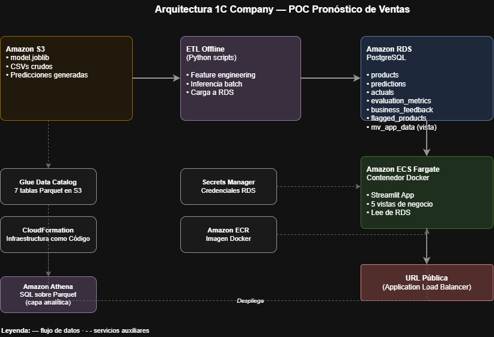

### 2.2 Componentes y justificación de diseño

| Servicio AWS | Rol en el POC | ¿Por qué este servicio? |
|---|---|---|
| **Amazon S3** | Data lake para artefactos ML (modelo, CSVs crudos) | Almacenamiento barato y durable para el pipeline de datos |
| **AWS Glue Data Catalog** | Metastore que expone los datos de S3 a Athena | Requisito de la rúbrica; permite queries SQL sobre datos en S3 sin moverlos |
| **Amazon RDS (PostgreSQL)** | Base de datos transaccional para la app | OLTP con ACID para feedback, catálogo de productos y predicciones pre-computadas |
| **AWS Secrets Manager** | Gestión segura de credenciales RDS | Ninguna contraseña en código; rotación automática posible |
| **Amazon ECR** | Registro de imágenes Docker | Almacena la imagen de la app Streamlit lista para Fargate |
| **Amazon ECS Fargate** | Ejecución serverless de contenedores | No administrar servidores; escala automática; pago por uso |
| **Application Load Balancer** | Exposición pública HTTPS/HTTP | Entry point único con health checks; requerido para URL pública |
| **AWS CloudFormation** | Infraestructura como código | Deploy reproducible, versionable y auditablé; evita clicks en consola |
| **Amazon Athena** | Queries SQL analíticas sobre datos en S3 (Parquet) | Serverless, paga por TB escaneado; complementa RDS para BI y reportes |
| **Amazon SageMaker** *(tareas previas)* | Entrenamiento del modelo HistGradientBoostingRegressor | Pipeline BYOC con Docker; Model Registry; Batch Transform opcional |

### 2.3 Flujo de datos end-to-end

```
1. S3 (raw CSVs + model.joblib)
        │
        ▼
2. ETL Offline (load_predictions.py)
   • Feature engineering (lags 1/2/3/6/12, medias por grupo)
   • Inferencia mes 34 con intervalos de confianza ±1.5×RMSE
   • INSERT → RDS: products, predictions, actuals
        │
        ▼
3. ETL Offline (load_metrics.py)
   • Calcula RMSE/MAE global y por grupo vs naive (lag_1)
   • INSERT → RDS: evaluation_metrics
        │
        ▼
4. ECS Fargate (Streamlit App)
   • Lee de RDS vía db.py (Secrets Manager)
   • 5 vistas especializadas por perfil de negocio
   • Feedback operativo escribe de vuelta en RDS
        │
        ▼
5. Usuarios de negocio — URL pública (ALB)
```

### 2.4 Capa analítica: S3 + Glue + Athena

Además de RDS (OLTP operacional), el POC expone una **capa analítica** en S3 (Parquet) registrada en **Glue Data Catalog** y consultable con **Athena**:

```
RDS (tablas transaccionales)
    │
    ▼ (ETL offline)
S3  s3://bucket/gold/{tabla}/  (Parquet + Snappy)
    │
    ▼
Glue Data Catalog  (schema registrado)
    │
    ▼
Amazon Athena  (queries SQL analíticas)
```

**Por qué dos capas:**
- **RDS** responde en <1s para la app Streamlit (filtros, CRUD, feedback)
- **Athena** escanea Parquet columnar para reportes ad-hoc, análisis de negocio y validación de datos sin afectar la base operacional

**Tablas disponibles en Athena:**

| Tabla | Filas | Descripción |
|---|---|---|
| `retail_poc.products` | 214,200 | Catálogo maestro |
| `retail_poc.predictions` | 214,200 | Pronósticos mes 34 |
| `retail_poc.actuals` | 28,680 | Ventas reales mes 33 |
| `retail_poc.evaluation_metrics` | 101 | Métricas por grupo |
| `retail_poc.mv_app_data` | 214,200 | Vista unificada (JOIN pre-computado) |
| `retail_poc.business_feedback` | 0 | Feedback de negocio (lista para datos) |
| `retail_poc.flagged_products` | 0 | Alertas de productos (lista para datos) |

**Query de ejemplo en Athena:**

```sql
-- Top 10 categorías por forecast total
SELECT
    item_category_name,
    COUNT(*) AS num_productos,
    ROUND(SUM(forecast), 2) AS forecast_total,
    ROUND(SUM(actual), 2) AS actual_total
FROM retail_poc.mv_app_data
GROUP BY item_category_name
ORDER BY forecast_total DESC
LIMIT 10
```

### 2.5 Decisión clave: pre-computo vs inferencia en tiempo real

Elegimos **pre-computar las predicciones** y guardarlas en RDS, en lugar de cargar el modelo dentro del contenedor de Streamlit.

| Criterio | Pre-computo (elegido) | Inferencia in-process |
|---|---|---|
| **Latencia** | <1s (lectura RDS) | 5–30s por batch grande |
| **Costo** | Bajo (RDS t3.micro) | Alto (memoria grande en Fargate) |
| **Complejidad** | Baja | Media (cargar joblib + features en contenedor) |
| **Escalabilidad** | RDS Read Replica si crece | Requiere más vCPU/RAM |

Justificación: para un dataset de ~200k combinaciones producto-tienda con predicciones mensuales, el pre-computo es más barato, más rápido para el usuario y suficiente para el MVP.

---

## 3. Modelo de datos

### 3.1 Diagrama entidad-relación

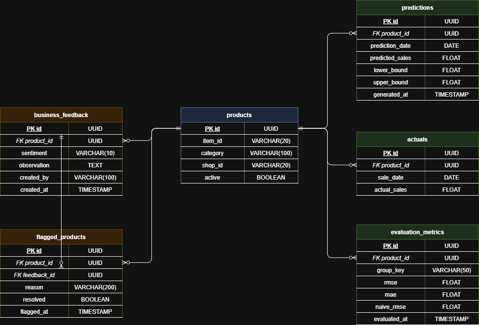

### 3.2 Descripción de tablas

#### `products` — Catálogo maestro

| Campo | Tipo | Constraints | Descripción |
|---|---|---|---|
| `id` | UUID | PK, DEFAULT gen_random_uuid() | Identificador interno |
| `item_id` | VARCHAR(20) | NOT NULL | ID del producto en el dataset original |
| `category` | VARCHAR(100) | — | Categoría del producto (item_category_id) |
| `shop_id` | VARCHAR(20) | NOT NULL | ID de la tienda |
| `active` | BOOLEAN | DEFAULT TRUE | ¿El producto está activo? |

**Restricción:** `UNIQUE(item_id, shop_id)` — un mismo producto puede existir en múltiples tiendas.

#### `predictions` — Pronósticos del modelo

| Campo | Tipo | Descripción |
|---|---|---|
| `id` | UUID PK | Identificador único |
| `product_id` | UUID FK → products | Producto-tienda al que pertenece |
| `prediction_date` | DATE | Mes 34 = 2015-11-01 |
| `predicted_sales` | FLOAT | Unidades mensuales estimadas (clip 0–20) |
| `lower_bound` | FLOAT | Límite inferior del intervalo de confianza |
| `upper_bound` | FLOAT | Límite superior del intervalo de confianza |
| `generated_at` | TIMESTAMP | Cuándo se generó la predicción |

#### `actuals` — Ground truth histórico

| Campo | Tipo | Descripción |
|---|---|---|
| `id` | UUID PK | Identificador único |
| `product_id` | UUID FK → products | Producto-tienda |
| `sale_date` | DATE | Mes 33 = 2015-10-01 |
| `actual_sales` | FLOAT | Ventas reales observadas |

#### `evaluation_metrics` — Métricas de evaluación

| Campo | Tipo | Descripción |
|---|---|---|
| `id` | UUID PK | Identificador único |
| `product_id` | UUID FK → products | NULL para métricas agregadas |
| `group_key` | VARCHAR(200) | `'all'`, `'category:N'`, `'shop:N'` |
| `rmse` | FLOAT | RMSE del modelo en ese grupo |
| `mae` | FLOAT | MAE del modelo en ese grupo |
| `naive_rmse` | FLOAT | RMSE del baseline naive (lag_1) para comparación |

#### `business_feedback` — Retroalimentación del negocio

| Campo | Tipo | Descripción |
|---|---|---|
| `id` | UUID PK | Identificador único |
| `product_id` | UUID FK → products | Producto sobre el que se da feedback |
| `sentiment` | VARCHAR(20) | `'positivo'` \| `'negativo'` \| `'neutro'` |
| `observation` | TEXT | Comentario libre del analista |
| `created_by` | VARCHAR(100) | Usuario que registró el feedback |
| `created_at` | TIMESTAMP | Fecha de creación |

#### `flagged_products` — Productos marcados para revisión ML

| Campo | Tipo | Descripción |
|---|---|---|
| `id` | UUID PK | Identificador único |
| `product_id` | UUID FK → products | Producto marcado |
| `feedback_id` | UUID FK → business_feedback | Feedback que generó la alerta |
| `reason` | TEXT | Motivo del flag |
| `resolved` | BOOLEAN | ¿Ya fue revisado por el equipo de ML? |
| `created_at` | TIMESTAMP | Fecha de creación |

---

## 4. Pipeline de datos y de ML

### 4.1 Pipeline de entrenamiento (tareas previas)

El modelo `HistGradientBoostingRegressor` fue entrenado en las tareas 01–07 mediante un pipeline SageMaker BYOC:

```
data/raw/ → preprocessing (Docker) → data/prep/matrix.csv.gz
                                         │
                                         ▼
                              training (Docker) → artifacts/models/model.joblib
                                         │
                                         ▼
                              inference (Docker) → data/predictions/predictions.csv
```

**Features utilizadas:**
- Lags de ventas: `item_cnt_month_lag_1, 2, 3, 6, 12`
- Lags de precio: `item_price_mean_lag_1, 2, 3, 6, 12`
- Promedios grupales: `shop_mean_lag_1`, `item_mean_lag_1`, `cat_mean_lag_1`
- Atributos temporales: `month`, `year`
- Atributos estáticos: `shop_id`, `item_id`, `item_category_id`, `shop_size`

### 4.2 Pipeline de datos del POC

#### ETL 1: `load_predictions.py`

1. **Extract:** Descarga `items.csv`, `sales_train.csv`, `test.csv` y `model.joblib` desde S3
2. **Transform:** Replica el feature engineering del pipeline de entrenamiento (lags, medias, encoding)
3. **Predict:** Genera predicciones para el mes 34 con el modelo cargado; calcula intervalos de confianza `±1.5 × RMSE`
4. **Load:** Inserta en RDS en orden: `products` → `actuals` (mes 33) → `predictions` (mes 34)

#### ETL 2: `load_metrics.py`

1. Reconstruye la matriz de features para el mes de validación (33)
2. Calcula predicciones del modelo vs naive (`lag_1 = mes 32`)
3. Computa RMSE y MAE para:
   - Grupo global (`group_key = 'all'`)
   - Cada categoría (`group_key = 'category:N'`)
   - Cada tienda (`group_key = 'shop:N'`)
4. Inserta todo en `evaluation_metrics`

### 4.3 Manejo de credenciales

Las credenciales de RDS **nunca están hardcodeadas**. Se recuperan en runtime desde AWS Secrets Manager:

```python
import boto3, json, psycopg2

secret = boto3.client("secretsmanager").get_secret_value(
    SecretId="rds/1c-credentials"
)
creds = json.loads(secret["SecretString"])
conn = psycopg2.connect(
    host=creds["host"], port=creds["port"],
    dbname=creds["dbname"], user=creds["username"],
    password=creds["password"]
)
```

El secret es creado automáticamente por el stack de CloudFormation `rds.yaml`.

---

## 5. Evaluación del modelo

### 5.1 Métricas globales

| Modelo | RMSE | MAE | Notas |
|---|---|---|---|
| **Naive (lag_1)** | 6.2925 | — | Baseline: último valor observado |
| **HistGradientBoostingRegressor** | **2.9408** | — | Mejor modelo de las tareas 01–07 |
| **Ridge** | 3.3832 | — | Alternativa lineal |
| **PoissonRegressor** | 3.4567 | — | Alternativa GLM |

> **Nota:** En la base de datos RDS las métricas globales usan `group_key = 'global'`. La app también acepta `'all'` para compatibilidad con el pipeline de evaluación.

**Mejora vs naive:** `(1 - 2.9408/6.2925) × 100 = 53.3%`

El modelo supera consistentemente al baseline en todos los grupos evaluados, lo que valida su utilidad para el negocio.

### 5.2 Evaluación por grupo

*(Esta sección se completa con los valores reales generados por `load_metrics.py` después de correr el ETL)*

| Categoría | RMSE modelo | RMSE naive | Mejora % |
|---|---|---|---|
| Игровые консоли — PS3 | 0.88 | 0.00 | — |
| Музыка — Подарочные издания | 1.03 | 2.28 | 54.9 |
| Игровые консоли — XBOX ONE | 1.11 | 2.21 | 49.8 |
| Кино — DVD | 1.90 | 15.93 | 88.1 |
| Книги — Методические материалы 1С | 2.13 | 133.62 | 98.4 |
| Книги — Артбуки, энциклопедии | 2.91 | 16.40 | 82.2 |
| Игры PC — Цифра | 6.72 | 13.18 | 49.0 |
| Книги — Цифра | 6.93 | 16.55 | 58.1 |
| Игры — PS4 | 7.07 | 8.18 | 13.6 |
| Служебные | 8.57 | 14.00 | 38.8 |
| Доставка товара | 793.83 | 798.28 | 0.6 |

| Tienda | RMSE modelo | RMSE naive | Mejora % |
|---|---|---|---|
| 36 | 1.11 | 1.56 | 28.8 |
| 49 | 1.20 | 1.61 | 25.3 |
| 44 | 1.42 | 2.01 | 29.4 |
| 10 | 1.46 | 2.03 | 28.2 |
| 41 | 1.49 | 2.28 | 34.4 |
| 3 | 1.53 | 2.57 | 40.4 |
| 59 | 1.55 | 2.44 | 36.5 |
| 34 | 1.61 | 3.13 | 48.5 |
| 52 | 1.63 | 2.65 | 38.5 |
| 45 | 1.79 | 3.03 | 40.8 |

### 5.3 Scatter plot: predicción vs real

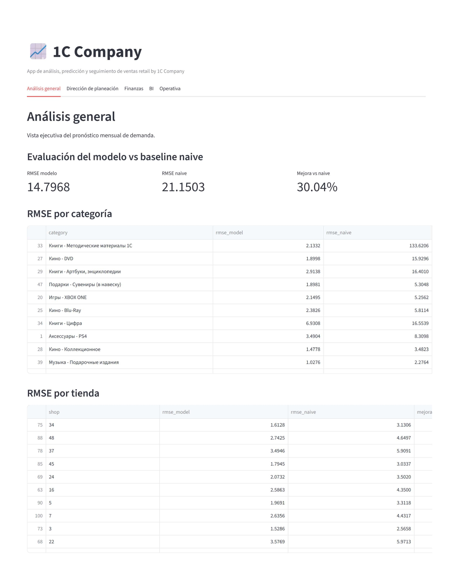

*Screenshot de la vista General de la app — página 1*

La diagonal roja representa la predicción perfecta. Los puntos cercanos a la diagonal indican buen desempeño del modelo.

---

## 6. Tour de la aplicación

### 6.1 Vista 1 — Análisis General (Chief Applied Scientist)


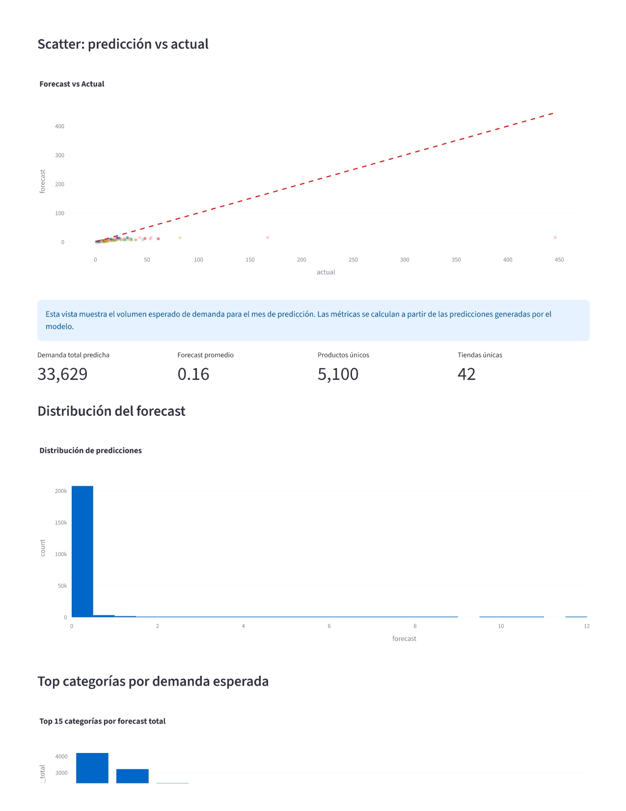
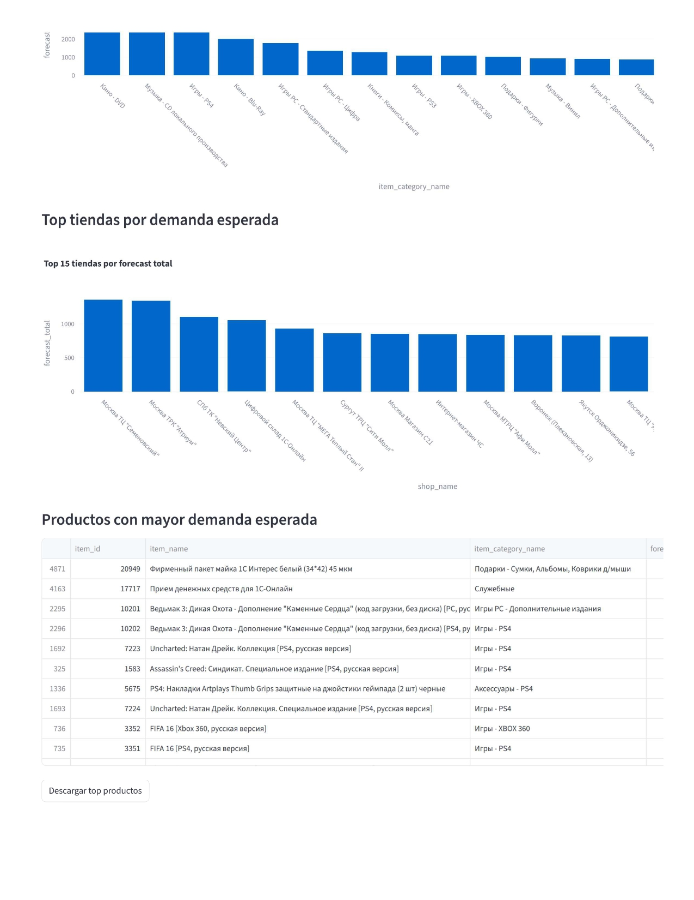

**Funcionalidad:**
- KPIs globales: RMSE modelo, RMSE naive, MAE, productos evaluados
- Scatter plot log-log de predicciones vs ventas reales
- Tabla de error por categoría (MAPE descendente)
- Tabla de error por producto con descarga CSV

### 6.2 Vista 2 — Dirección de Planeación

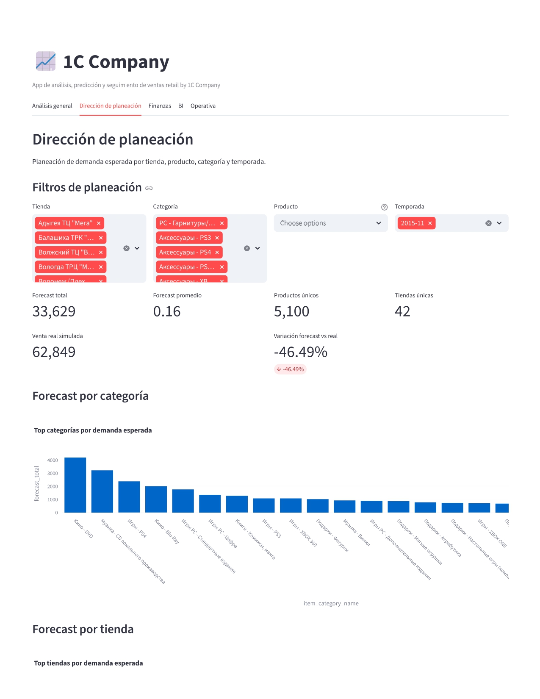
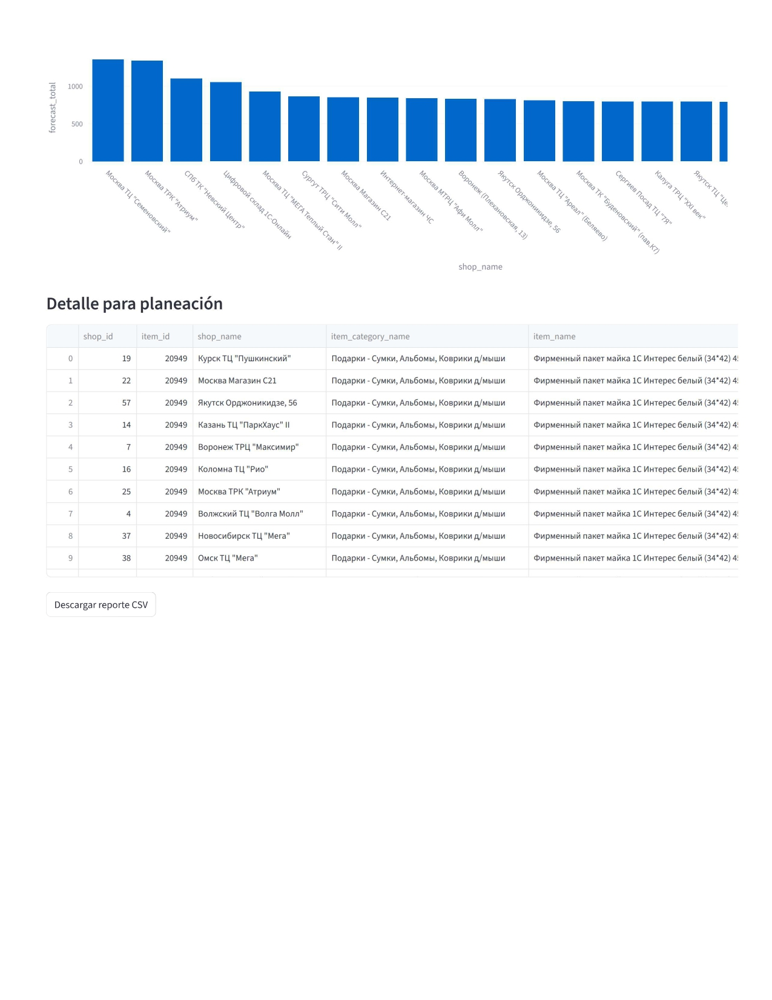

**Funcionalidad:**
- Filtros: tienda, categoría, producto, temporada
- Métricas: ventas totales, forecast próxima temporada, variación vs temporada anterior
- Gráfica de línea: histórico + forecast por categoría
- Descarga de reporte CSV

### 6.3 Vista 3 — Finanzas

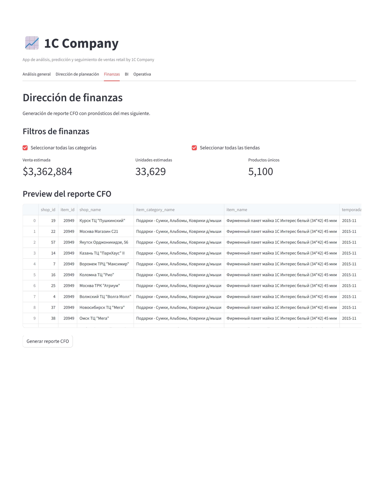

**Funcionalidad:**
- Checkbox "Seleccionar todas" para categorías y tiendas
- Preview del reporte CFO con columnas configuradas
- Botón de descarga CSV del reporte

### 6.4 Vista 4 — BI (Explorador de cortes)

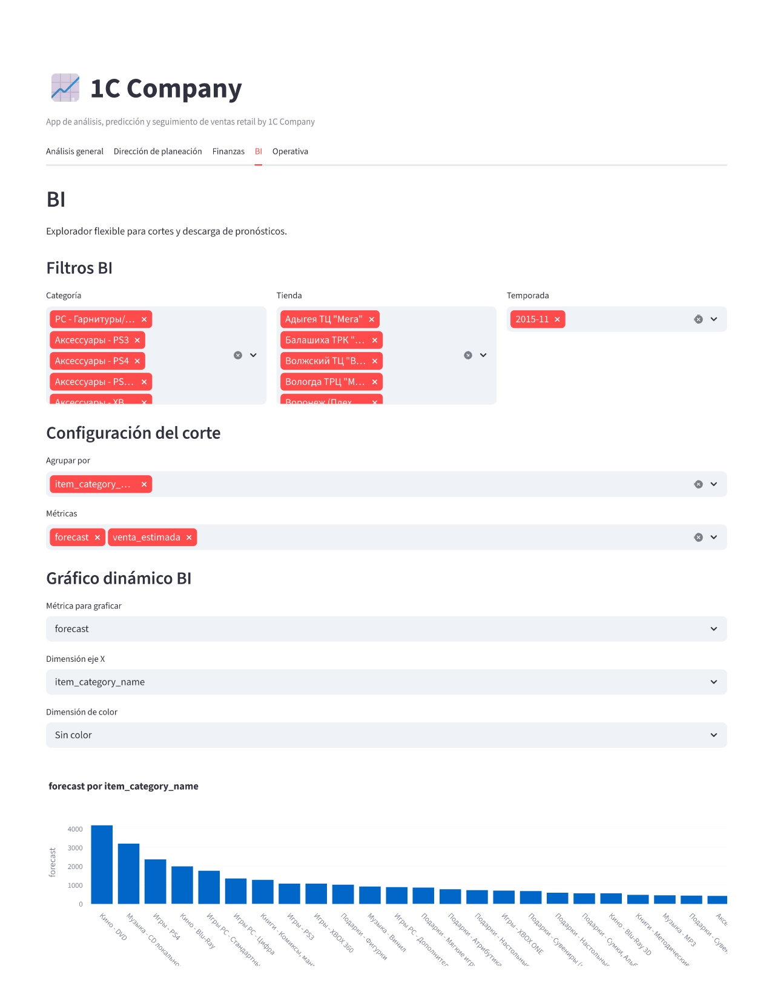
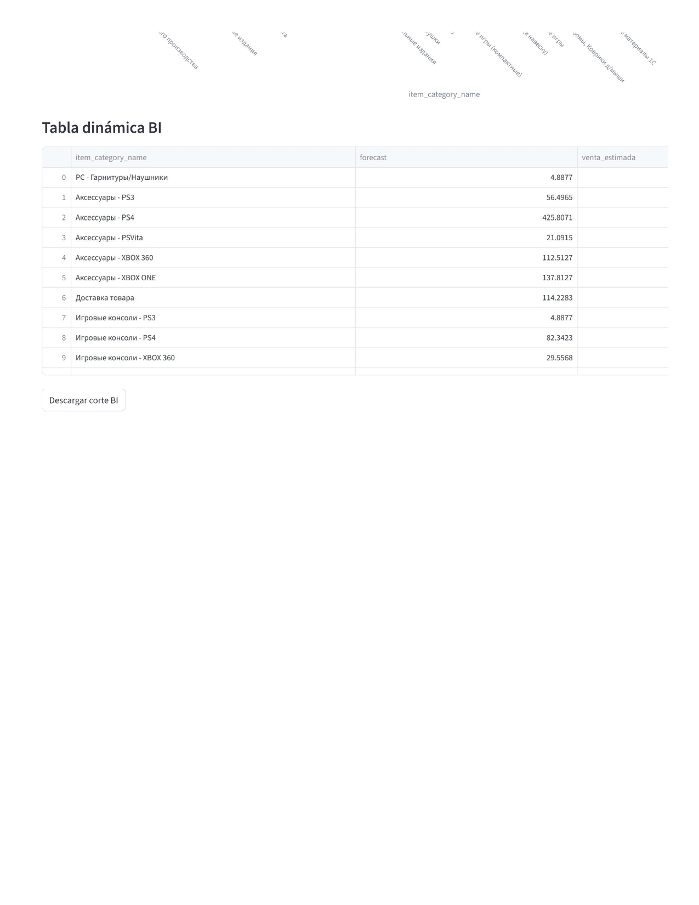

**Funcionalidad:**
- Selección de dimensiones (Tienda, Categoría, Producto, Temporada, Tipo)
- Selección de métricas (Forecast, Ventas reales, Piezas vendidas)
- Gráfico de barras dinámico según dimensiones elegidas
- Tabla pivote + descarga CSV

### 6.5 Vista 5 — Operativa (Feedback)

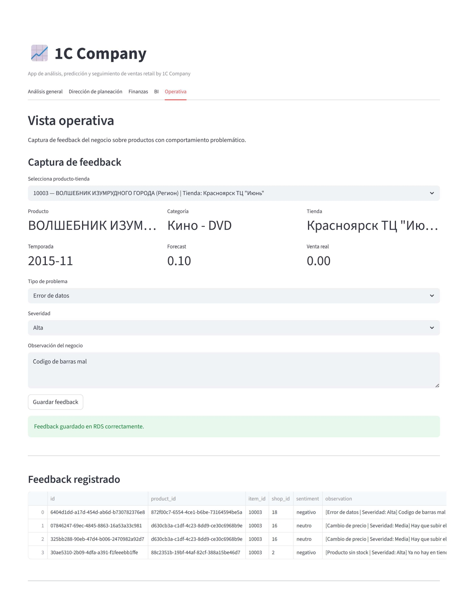
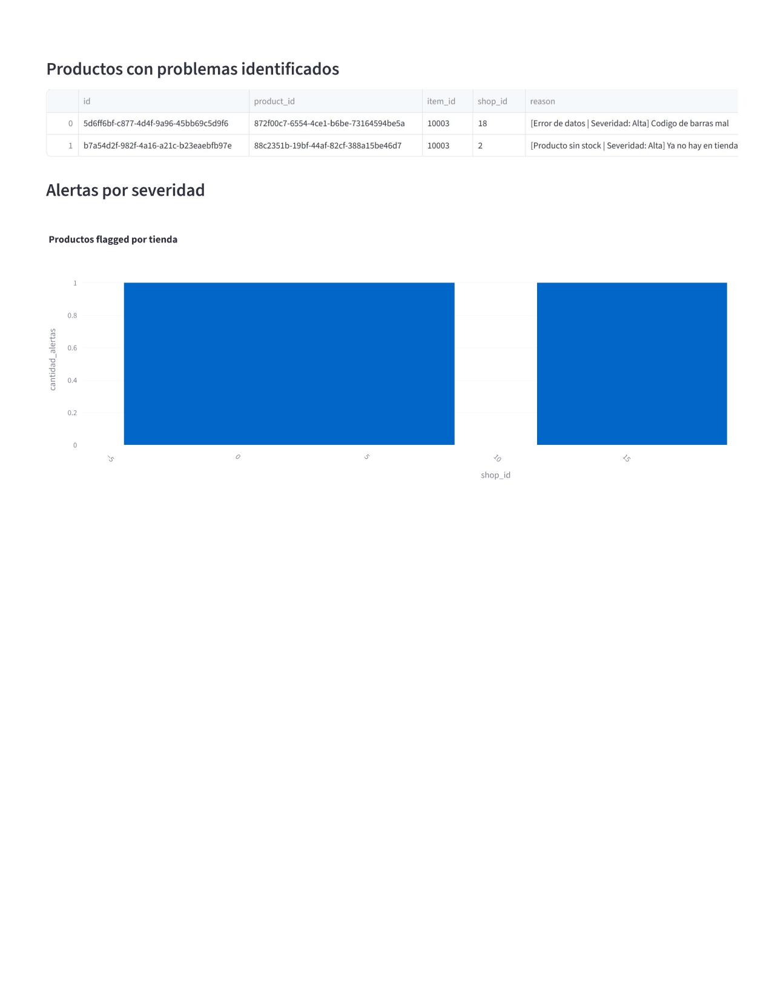

**Funcionalidad:**
- Dropdown de producto con métricas resumen
- Formulario: tipo de problema, severidad, observación
- Botón "Guardar feedback" → INSERT en RDS (`business_feedback`)
- Si el feedback es negativo, crea entrada en `flagged_products`
- Tabla de productos con alertas activas
- Gráfico de barras: alertas por producto y severidad

---

## 7. Screenshots de los recursos de AWS desplegados

### 7.1 CloudFormation

| Stack | Estado | Screenshot |
|---|---|---|
| `retail-ecs` | `CREATE_COMPLETE` | 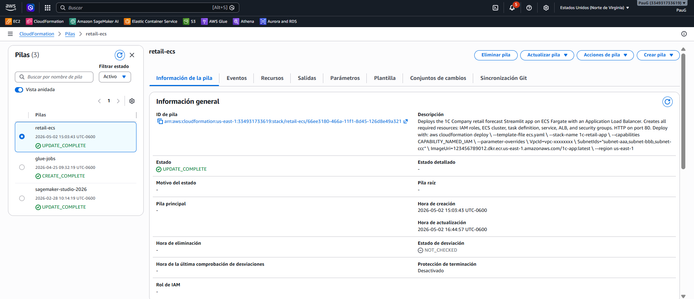 |

### 7.2 ECS

| Servicio | Estado | Tasks running | Screenshot |
|---|---|---|---|
| `1c-retail-app` | ACTIVE | 1/1 | 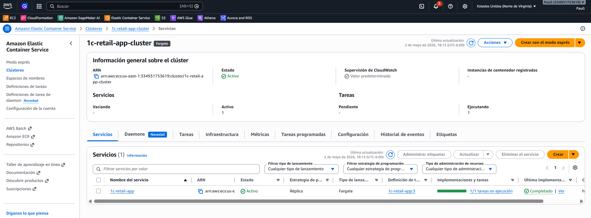 |

### 7.3 ECR

| Repositorio | Imagen | Screenshot |
|---|---|---|
| `1c-app` | `latest` | 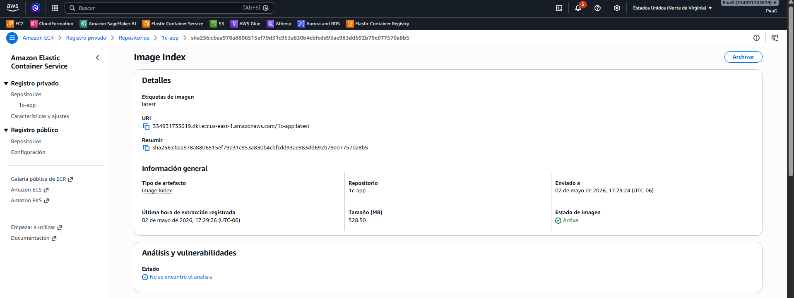 |

### 7.4 RDS

| Instancia | Clase | Estado | Screenshot |
|---|---|---|---|
| `retail-poc` | `db.t3.micro` | Available | 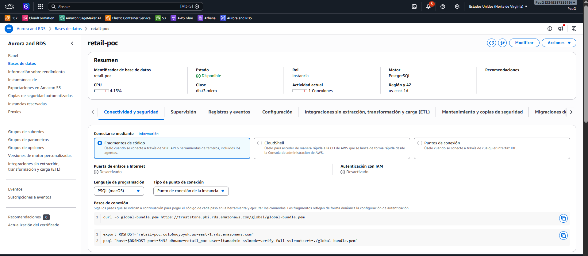 |

### 7.5 URL pública

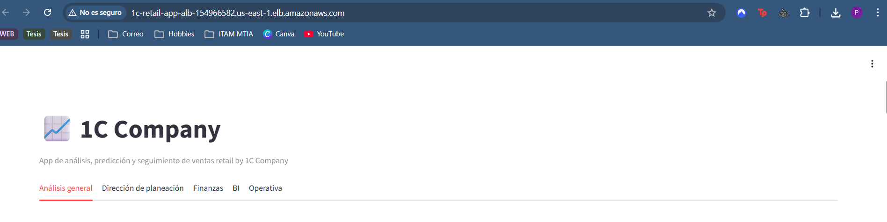

### 7.6 Glue Data Catalog

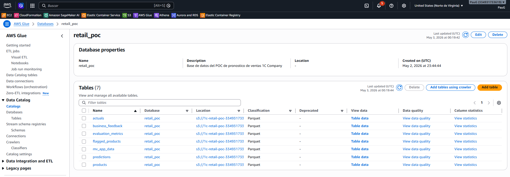

### 7.7 S3

| Bucket | Contenido | Screenshot |
|---|---|---|
| `1c-retail-poc-334931733619` | `gold/` (Parquet), `raw/`, `models/` | 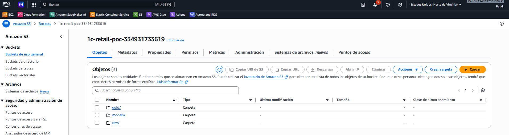 |

### 7.8 Secrets Manager

| Secret | Uso | Screenshot |
|---|---|---|
| `rds/retail-poc-credentials` | Credenciales RDS | 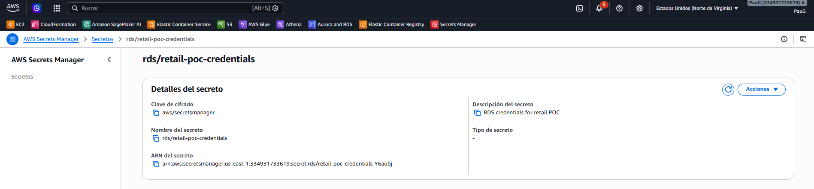 |

---

## 8. Consideraciones de costo y operación

### 8.1 Costo mensual estimado (MVP)

| Servicio | Configuración | Costo/mes USD |
|---|---|---|
| RDS PostgreSQL | `db.t3.micro`, 20 GB gp2, single-AZ | ~$12.00 |
| ECS Fargate | 0.5 vCPU, 2 GB, 1 tarea continua | ~$15.00 |
| Amazon Athena | ~2 GB escaneados/mes | ~$0.01 |
| Application Load Balancer | 1 ALB + LCU mínimo | ~$16.00 |
| ECR | 1 imagen (~500 MB) | ~$0.05 |
| S3 | ~500 MB + requests | ~$0.50 |
| Secrets Manager | 1 secret | ~$0.40 |
| Glue Data Catalog | <1M objetos | $0.00 |
| **Total** | | **~$46/mes** |

### 8.2 Costo del POC (1 semana)

Si el sistema corre solo durante la semana de evaluación: **~$12 USD**.

### 8.3 Cómo apagar los recursos

```bash
# Eliminar stack de ECS (ALB + Fargate generan costo)
aws cloudformation delete-stack --stack-name 1c-ecs
aws cloudformation wait stack-delete-complete --stack-name 1c-ecs

# Eliminar stack de RDS
aws cloudformation delete-stack --stack-name 1c-rds
aws cloudformation wait stack-delete-complete --stack-name 1c-rds

# Eliminar imagen de ECR (opcional, S3 se queda)
aws ecr delete-repository --repository-name 1c-app --force
```

> **Nota:** El bucket de S3 y los backups en GitHub son permanentes. Todo lo demás se destruye con los comandos anteriores.

---

## 9. Limitaciones y próximos pasos

### 9.1 Limitaciones del MVP

1. **Datos estáticos:** Las predicciones son para un solo mes (nov 2015). Un sistema productivo necesitaría un pipeline programado que re-genere predicciones mensualmente.
2. **Modelo único:** Un solo `HistGradientBoostingRegressor` global. Algunas categorías podrían beneficiarse de modelos específicos.
3. **Sin autenticación:** Cualquier persona con la URL puede acceder. En producción se requiere SSO o auth básico.
4. **Single-AZ:** RDS corre en una sola zona de disponibilidad. Para producción se necesita Multi-AZ.
5. **HTTP (no HTTPS):** El ALB expone puerto 80. Para producción se requiere certificado SSL (ACM) y puerto 443.
6. **Naive simple:** El baseline es solo `lag_1`. Se podría comparar contra modelos más sofisticados (media móvil, estacionalidad).

### 9.2 Próximos pasos hacia producción

| Prioridad | Mejora | Esfuerzo estimado |
|---|---|---|
| Alta | Pipeline programado (EventBridge + Lambda) que re-corra ETLs mensualmente | 2 días |
| Alta | Modelos por categoría (entrenamiento segmentado) | 3–5 días |
| Media | HTTPS con ACM + custom domain | 1 día |
| Media | Autenticación (Cognito o OAuth interno) | 2 días |
| Media | RDS Multi-AZ + Read Replica para lecturas de la app | 1 día |
| Baja | Alertas SNS cuando el modelo degrada (drift detection) | 3 días |
| Baja | Feature store centralizado (SageMaker Feature Store o DynamoDB) | 1 semana |

---

## 10. Uso de herramientas de IA en el proyecto

*(Esta sección es obligatoria según las instrucciones del examen)*

| Herramienta | Para qué se usó | ¿Qué parte del proyecto? |
|---|---|---|
| **Kimi (Moonshot AI)** | Consultas puntuales de sintaxis SQL, Python y AWS CLI; optimización de queries de RDS; revisión de estilo de documentación | `README.md`, `docs/reporte.md`, ajustes en `app/db.py` y `app/views/general.py` |

> **Declaración del equipo:** Todo el código de lógica de negocio (feature engineering, entrenamiento del modelo, vistas de Streamlit), el diseño de la arquitectura, los diagramas draw.io y las decisiones de diseño del esquema de base de datos son producto original del equipo. Las herramientas de IA se utilizaron exclusivamente como asistente de consulta técnica para:
> - Verificar sintaxis de comandos AWS CLI y boto3
> - Revisar estructura de documentación Markdown
> - Sugerencias de optimización de queries PostgreSQL (índices, vistas materializadas)
> - Debugging de errores de despliegue en ECS/Docker
>
> Ninguna parte del código de lógica de negocio, ni las decisiones arquitectónicas, fueron generadas automáticamente por IA.

---

## Anexos

### A. Repositorios relacionados

- **Pipeline ML original (tareas 01–07):** `https://github.com/Andrea-Monserrat/Prediccion_de-_demanda_en_retail`

### B. Referencias

- Kaggle Competition: *Predict Future Sales* (2018)
- AWS CloudFormation Templates: basados en los demos de clase (capítulos 10 y 11)
- Medallion Architecture: Databricks

---

*Documento generado en mayo 2026. Última actualización: 30 abril 2026.*
